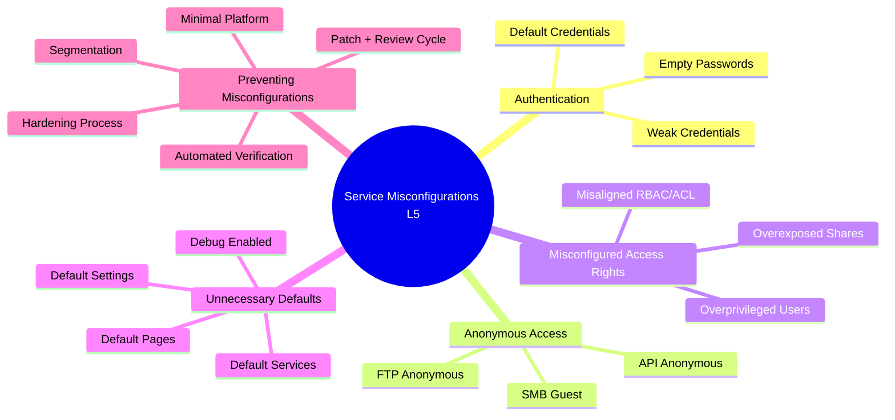

# **Service Misconfigurations – Elevation Level 5 (Advanced Attack Framework)**

This document expands the HTB module *Service Misconfigurations* (fileciteturn1file0) into an **advanced red-team framework**.
Nội dung được nâng lên cấp chiến thuật, bao gồm:

* Attack Flowcharts
* Exploit Chains
* Red-Team Playbooks
* MITRE & Kill Chain Mapping
* STRIDE Threat Modeling
* Universal Decision Trees
* Case Studies & Practical Examples

---

# **📘 MỤC LỤC**

1. [Giới thiệu](#introduction)
2. [Mindmap Elevation Level 5](#mindmap)
3. [Authentication Misconfigurations – Advanced Model](#auth)
4. [Anonymous Access – Advanced Model](#anonymous)
5. [Misconfigured Access Rights – Advanced Model](#access-rights)
6. [Unnecessary Defaults – Advanced Model](#defaults)
7. [Global Exploit Chains](#exploit-chains)
8. [Red-Team Playbooks](#playbooks)
9. [MITRE + Kill Chain Mapping](#mitre)
10. [STRIDE Threat Modeling](#stride)
11. [Universal Misconfiguration Decision Tree](#decision-tree)
12. [Case Studies](#cases)
13. [Defense Mapping](#defense)
14. [Key Takeaways](#key-takeaways)

---

# <a name="introduction"></a> **1. Giới thiệu**

Service Misconfigurations là **một trong những nguyên nhân hàng đầu** dẫn đến compromise hệ thống. Vì mọi service đều:

* chạy với quyền cao,
* nhận request từ mạng,
* và phụ thuộc vào cấu hình.

**Elevation Level 5** biến nội dung gốc thành **framework tấn công chiến thuật**, giúp bạn hiểu cách attacker khai thác sai cấu hình trong môi trường thật.

---

# <a name="mindmap"></a> **2. Mindmap Elevation Level 5 – Service Misconfigurations**



---

# <a name="auth"></a> **3. Authentication Misconfigurations – Elevation Level 5**

Misconfigurations include:

* Default credentials: `admin:admin`, `root:123456`
* Weak or temporary passwords left unchanged
* Blank passwords

## **3.1 Attack Flowchart – Authentication**

```
Grab Banner → Identify Service →
  ├── Known default creds?
  ├── Weak passwords?
  ├── Empty password allowed?
If YES → Immediate Access
If NO → Switch to password spraying or key-based attacks
```

## **3.2 Exploit Chain – Default Credential Takeover**

```
1. Service exposes login interface
2. Default password unchanged
3. Attacker logs in → service-level control
4. PrivEsc via service permissions
5. Lateral movement from compromised service
```

## **3.3 Red-Team Playbook – Authentication Misconfigs**

* Check banner → look for vendors with known defaults
* Try top 20 weak credentials
* Use password spraying to avoid lockouts
* Try empty passwords on legacy services

## **3.4 Detection Indicators**

* Multiple login attempts to known admin accounts
* Successful login without password

---

# <a name="anonymous"></a> **4. Anonymous Access – Elevation Level 5**

Anonymous access = service cho phép kết nối **không cần password**.

* FTP → `ftp anonymous`
* SMB → Guest login
* Web/API → no-auth endpoints

## **4.1 Attack Flowchart – Anonymous Access**

```
Check login requirement →
  ├── Anonymous allowed?
  │      ├── Browse files
  │      ├── Read secrets
  │      └── Upload shells (FTP)
  └── If anonymous disabled → search misconfig in ACL
```

## **4.2 Exploit Chain – Anonymous Exposure**

```
1. Anonymous login allowed
2. Attacker enumerates directories
3. Sensitive files found (creds, config)
4. Use leaked data to escalate attack
5. Pivot to other services
```

## **4.3 Red-Team Playbook**

* Enumerate anonymously first (no noise)
* Search config backups, DB dumps, SSH keys

## **4.4 Detection Indicators**

* Logins from unauthenticated users
* Anonymous SMB/FTP directory browsing

---

# <a name="access-rights"></a> **5. Misconfigured Access Rights – Elevation Level 5**

Sai quyền truy cập là một trong những misconfig nguy hiểm nhất.

## **5.1 Attack Flowchart – Misconfigured Access Rights**

```
Login as low-priv user →
  ├── Can read privileged directories?
  ├── Can upload to sensitive paths?
  ├── Overexposed shares?
If YES → escalate using leaked information
If NO → attempt privilege escalation at OS level
```

## **5.2 Exploit Chain – Overprivileged User**

```
1. User has excess privileges
2. Attacker gains access via weak creds
3. Reads sensitive data
4. Finds credentials/configs/logs
5. Uses data to pivot further
```

## **5.3 Red-Team Playbook**

* Search for paths where low-priv users shouldn't have access
* Dump all readable config files
* Download `.env`, `.conf`, backups, logs

## **5.4 Detection Indicators**

* Low-priv users accessing admin folders
* Excessive read/write events

---

# <a name="defaults"></a> **6. Unnecessary Defaults – Elevation Level 5**

Defaults include:

* Default services
* Default accounts
* Debug mode on
* Default pages (setup.php)
* Unneeded components

## **6.1 Attack Flowchart – Defaults Abuse**

```
Service → Check default components →
  ├── Default credentials?
  ├── Default pages?
  ├── Default services enabled?
  ├── Debug endpoints?
If YES → exploit
If NO → proceed to config enumeration
```

## **6.2 Exploit Chain – Default Component Abuse**

```
1. Default component active
2. Attacker discovers entry point
3. Uses built-in functionality to bypass security
4. Gains shell or retrieves secrets
5. Expands attack surface
```

## **6.3 Red-Team Playbook**

* Scan for default pages (`/admin`, `/setup`, `/phpmyadmin`)
* Test default SNMP communities
* Abuse debug endpoints

## **6.4 Detection Indicators**

* Requests to setup or install pages
* Access to debug or developer URLs

---

# <a name="exploit-chains"></a> **7. Global Exploit Chains**

### **Universal Misconfiguration Exploit Chain**

```
1. Enumeration → Identify weak configuration
2. Leverage weak/passwordless access
3. Extract sensitive data
4. Use data to escalate privileges
5. Pivot to connected services
6. Maintain persistence
7. Exfiltrate data
```

### **Multi-Service Pivot Chain**

```
FTP misconfig → grab DB creds → login SQL → dump user table → login SSH → become root
```

---

# <a name="playbooks"></a> **8. Red-Team Playbooks**

## **8.1 FTP Misconfig Playbook**

* Test anonymous
* Test weak creds
* Attempt write in upload dirs
* Upload webshell if webroot mapped

## **8.2 SMB Misconfig Playbook**

* Test null session
* Enumerate shares
* Find accessible sensi
