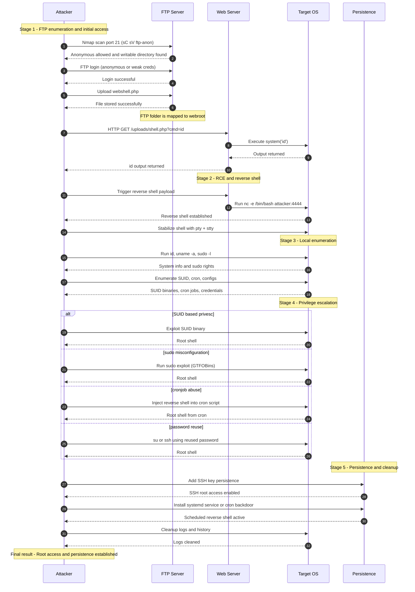
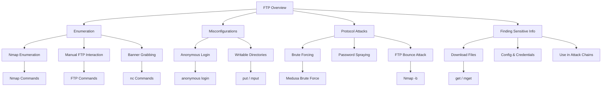
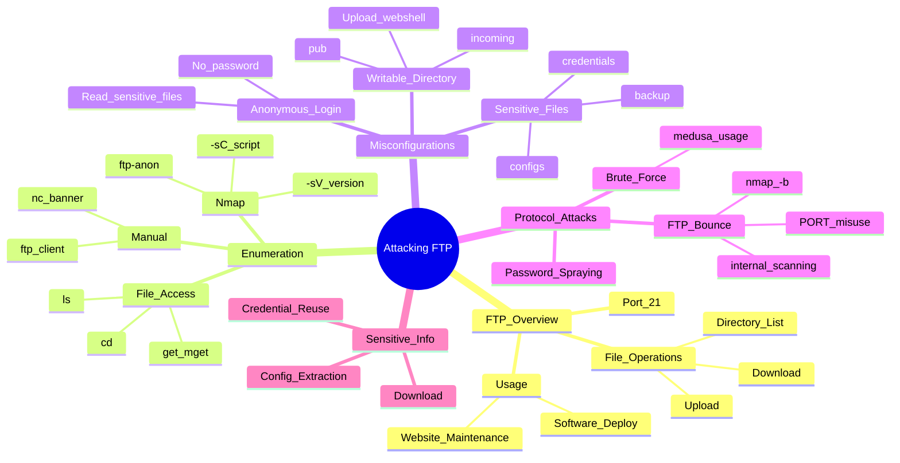
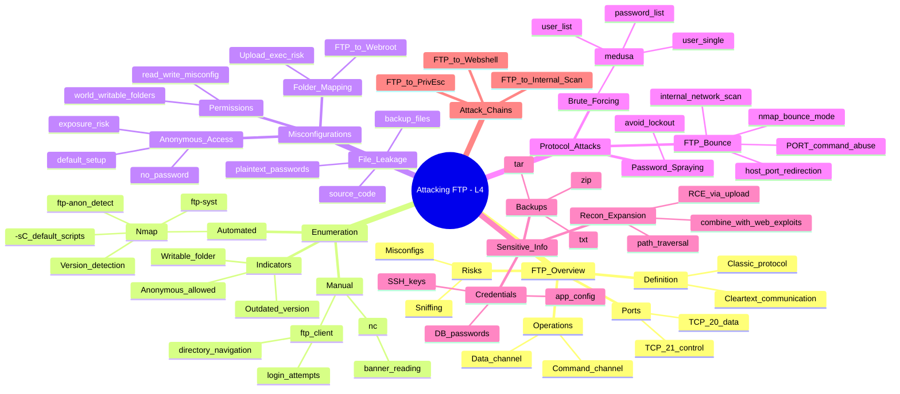

# Real-World Attack Chain  
## FTP → Webshell → Reverse Shell → PrivEsc → Persistence

Tài liệu này mô tả toàn bộ chuỗi tấn công dưới dạng **Mermaid Sequence Diagram**, từ lúc attacker phát hiện FTP misconfig cho tới khi đạt được **root + persistence**.

---

## 1. Sequence Diagram – Toàn bộ luồng tấn công



---

## 2. Tóm tắt chuỗi tấn công

1. **FTP Enumeration**
2. **Initial Access (Anonymous/Weak Login)**    anonymous là tài khoản mặc định nếu chưa cấu hình gì
3. **Upload Webshell → RCE**
4. **Reverse Shell**
5. **Local Enumeration**
6. **Privilege Escalation**
7. **Persistence (SSH key, systemd, cron)**
8. **Anti-Forensics**

---


# 📘 Attacking FTP – Luồng Kiến Thức + Câu Lệnh + Flowchart + Mindmap Elevation Level 3–4

Tài liệu tổng hợp kiến thức từ **Attacking FTP – HTB Academy** dưới dạng:
- **Luồng kiến thức (knowledge flow)**
- **Danh sách đầy đủ câu lệnh (commands)**
- **Flowchart Mermaid**
- **Mindmap Elevation Level 3 & 4**

---

# ## 1. FLOWCHART – LUỒNG KIẾN THỨC




---

# ## 2. DANH SÁCH CÂU LỆNH – FULL COMMAND SET

### 🔹 **Nmap Enumeration**
```bash
sudo nmap -sC -sV -p 21 <IP>
```

### 🔹 **FTP Bounce Attack**
FTP Bounce Attack là kỹ thuật tấn công lợi dụng lệnh PORT của FTP để:
👉 Buộc FTP server gửi dữ liệu đến một máy khác trong mạng nội bộ, chứ không phải gửi cho attacker.
Vì vậy attacker có thể:
    Dùng FTP server như proxy
    Gửi yêu cầu tới máy nội bộ (Internal_DMZ) mà bình thường attacker không truy cập được
    Scan port hoặc thu thập thông tin của máy đó
    
Attacker có thể:
    Scan mạng nội bộ qua FTP server
    Từ bên ngoài vẫn “nhìn thấy” port open bên trong
    Sử dụng thông tin đó để mở rộng tấn công vào nội bộ

```bash
nmap -Pn -v -n -p80 -b anonymous:password@10.10.110.213 172.17.0.2
```

### 🔹 **FTP Client Commands**
```bash
ftp <IP>
ls
cd <folder>
get <file>
mget *
put <file>
mput <files>
help
```

### 🔹 **Netcat Banner Grabbing**
```bash
nc <IP> 21
```

### 🔹 **Medusa Brute Force**
```bash
medusa -u <user> -P /usr/share/wordlists/rockyou.txt \
-h <IP> -M ftp
```

---

# ## 3. MINDMAP – ELEVATION LEVEL 3



---

# ## 4. MINDMAP – ELEVATION LEVEL 4 (SIÊU CHI TIẾT)



---

# ## 5. KẾT LUẬN

File này tổng hợp:

- Kiến thức FTP → Misconfig → Attack Surface  
- Câu lệnh thực chiến đầy đủ  
- Flowchart + Mindmap Elevation 3 & 4  
→ Sẵn dùng cho **HTB**, **CTF**, **Red Team Playbook**, **Learning Notebook**.

---


