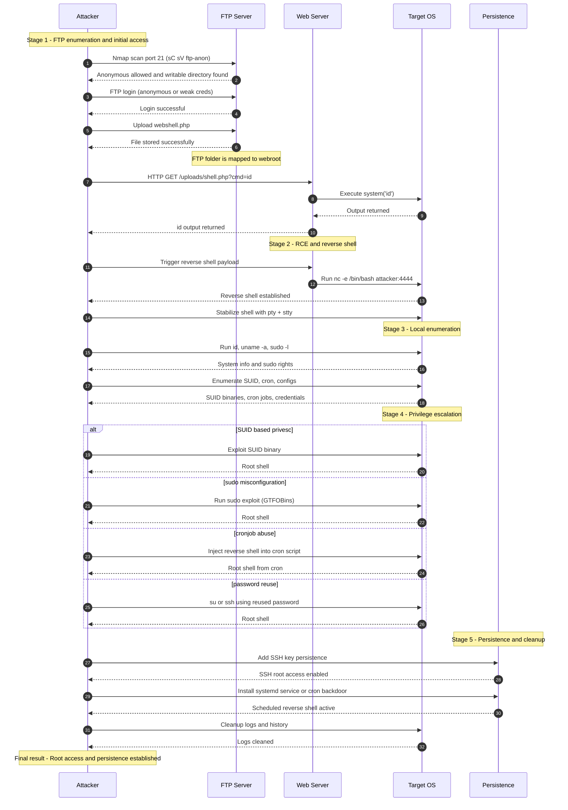

# Real-World Attack Chain  
## FTP → Webshell → Reverse Shell → PrivEsc → Persistence

Tài liệu này mô tả toàn bộ chuỗi tấn công dưới dạng **Mermaid Sequence Diagram**, từ lúc attacker phát hiện FTP misconfig cho tới khi đạt được **root + persistence**.

---

## 1. Sequence Diagram – Toàn bộ luồng tấn công

---

## 2. Tóm tắt chuỗi tấn công

1. **FTP Enumeration**
2. **Initial Access (Anonymous/Weak Login)**
3. **Upload Webshell → RCE**
4. **Reverse Shell**
5. **Local Enumeration**
6. **Privilege Escalation**
7. **Persistence (SSH key, systemd, cron)**
8. **Anti-Forensics**

---
